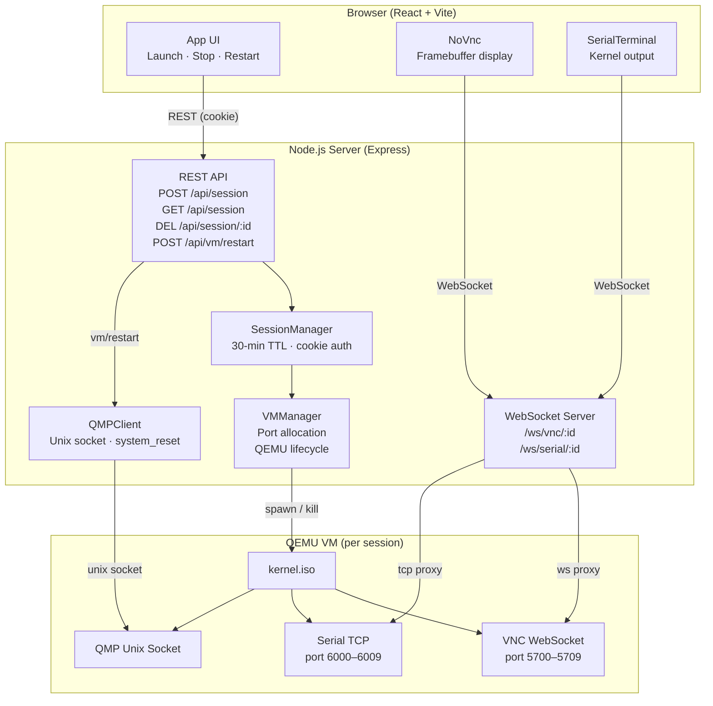

# BrowserBoot

> Boot a real virtual machine and access it entirely from your browser.

BrowserBoot launches an ephemeral **QEMU** virtual machine for every session and streams both its **graphical display** and **serial console** over WebSockets. No VNC client, SSH client, or additional software required — just open the browser and click **Launch**.

## Requirements

- **Docker & Docker Compose** (recommended), **or**
- **Node.js 22+** and `qemu-system-x86_64` available on your `PATH`

## Running

### With Docker (recommended)

Builds the server (with QEMU) and the client (built and served via nginx, which also proxies API/WebSocket traffic to the server) as two containers.

```bash
docker compose up --build
```

Then open **http://localhost:8080**.

### Without Docker

```bash
# from the repo root
npm install
npm run dev
```

Runs the client (Vite dev server) and server concurrently.

## Architecture



| Component | Role |
|-----------|------|
| **SessionManager** | Creates/destroys sessions; stores state in memory with a 30-min cookie TTL |
| **VMManager** | Spawns `qemu-system-x86_64` per session; allocates VNC (5900–5909) & serial (6000–6009) ports |
| **QMPClient** | Sends `system_reset` to a running VM over its Unix QMP socket |
| **VNC proxy** | Pipes browser WebSocket ↔ QEMU's built-in VNC WebSocket |
| **Serial proxy** | Pipes browser WebSocket ↔ QEMU serial TCP port |

## Project layout

```
BrowserBoot/
├── client/           # React/Vite frontend (noVNC + xterm.js)
├── server/           # Express/ws backend, QEMU process management
├── kernels/          # Boot image(s) — drop your own .iso here
├── runtime/qmp/      # QMP unix sockets (created at runtime, not tracked)
└── docker-compose.yml
```
